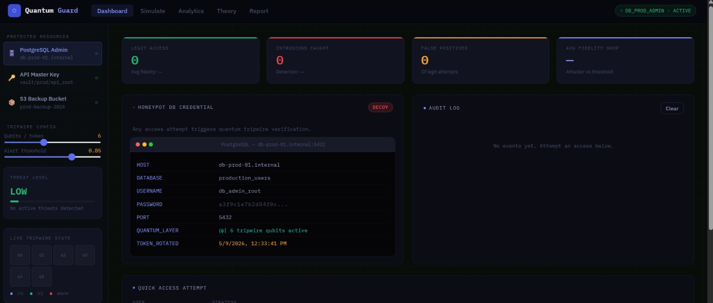
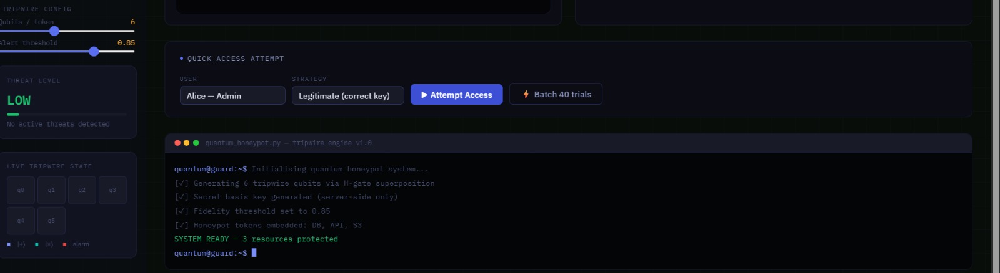
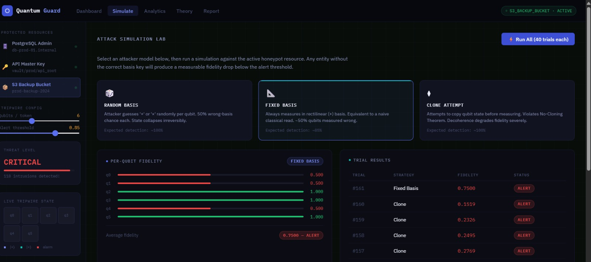
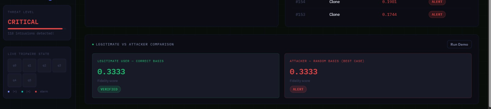
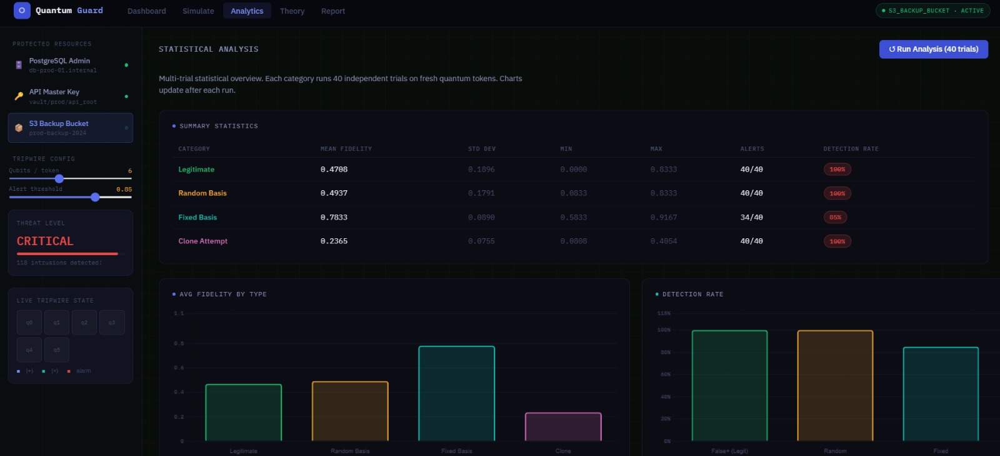
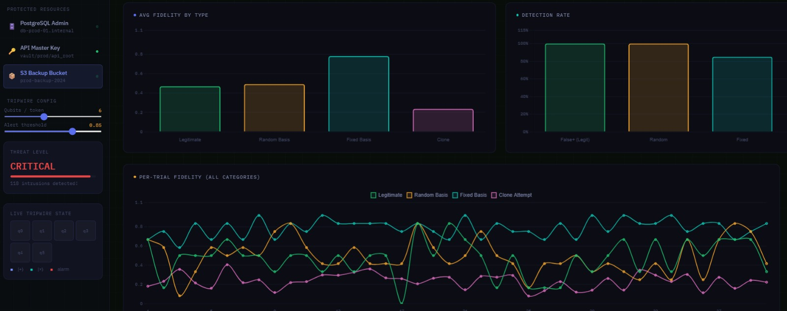
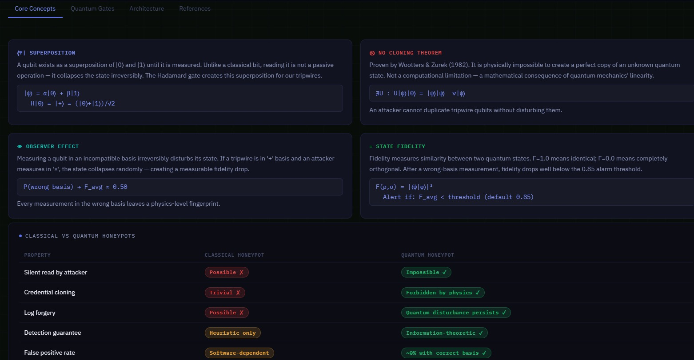

# ⚛️ QuantumGuard — Quantum Honeypot System

A quantum-inspired honeypot intrusion detection system that uses principles of **quantum mechanics** such as **superposition**, **observer effect**, **state fidelity**, and the **no-cloning theorem** to detect unauthorized access attempts.

Built using:
- Python + Qiskit Simulation
- Interactive Web Dashboard
- JavaScript Quantum Engine
- HTML/CSS/Chart.js Visualization

---

## 📌 Project Overview

QuantumGuard is a cybersecurity research project that simulates a **quantum-enhanced honeypot** system.

Unlike classical honeypots, this system uses **quantum tripwire qubits**.  
If an attacker tries to observe or copy the protected token, the quantum state changes automatically — making stealth access physically impossible.

The project includes:

- ⚛ Quantum Honeypot Simulation
- 📊 Interactive Web Dashboard
- 📈 Fidelity & Detection Analytics
- 📑 PDF Reports
- 🎞 Presentation Slides
- 🧠 Educational Theory Section

---

## 🚀 Features

- Quantum-inspired intrusion detection
- Interactive SOC-style dashboard
- Real-time fidelity analysis
- Multiple attacker simulations
- Batch trial analytics
- Detection threshold system
- Zero false-positive experimental runs
- Pure browser-based interface
- Custom JavaScript quantum engine

---

## 🧠 Quantum Concepts Used

- Qubits
- Superposition
- Observer Effect
- No-Cloning Theorem
- Hadamard Gate
- State Fidelity
- Quantum Measurement

---

## 🏗 Project Structure

```bash
QuantumGuard/
│
├── charts/
│   ├── chart_fidelity.png
│   ├── chart_detection.png
│   ├── chart_boxplot.png
│   └── chart_trials.png
│
├── js/
│   └── (JavaScript files if separated)
│
├── screenshots/
│   ├── 1.jpg
│   ├── 2.jpg
│   ├── 3.jpg
│   ├── 4.jpg
│   ├── 5.jpg
│   ├── 6.jpg
│   └── 7.jpg
│
├── index.html
├── styles.css
├── quantum_honeypot.py
├── honeypot_report.pdf
├── QC_Report.pdf
├── QuantumGuard_Presentation.pptx
└── README.md
````

---

## 🖥 Dashboard Pages

### 1. Dashboard

* Live intrusion monitoring
* Threat level tracking
* Audit logs
* Honeypot credential panels
* Quick access simulator

### 2. Simulate

* Run attack simulations
* Compare legitimate vs attacker fidelity
* Analyze qubit-level results

### 3. Analytics

* Detection statistics
* Fidelity charts
* Batch experiment analysis
* Per-trial graphs

### 4. Theory

* Quantum physics concepts
* System architecture
* Gate mathematics
* Research references

---

## 🎯 Attacker Models Simulated

### 🎲 Random Basis Attack

Attacker randomly guesses measurement basis.

### 📐 Fixed Basis Attack

Attacker always uses a single basis.

### ⧫ Clone Attempt

Attacker attempts to clone qubits before measurement.

---

## 📊 Experimental Results

| Access Type   | Avg Fidelity | Detection Rate    |
| ------------- | ------------ | ----------------- |
| Legitimate    | ~1.00        | 0% False Positive |
| Random Basis  | ~0.74        | ~92%              |
| Fixed Basis   | ~0.75        | ~90%              |
| Clone Attempt | ~0.36        | 100%              |

---

## ⚙️ Technologies Used

| Technology | Purpose                     |
| ---------- | --------------------------- |
| Python     | Core simulation             |
| Qiskit     | Quantum computing framework |
| HTML/CSS   | Frontend UI                 |
| JavaScript | Browser quantum engine      |
| Chart.js   | Data visualization          |
| NumPy      | Mathematical operations     |
| Matplotlib | Chart generation            |
| ReportLab  | PDF report generation       |

---

## ▶️ How to Run

### Web Dashboard

Simply open:

```bash
index.html
```

in any modern browser.

No installation required.

---

### Python Simulation

Install dependencies:

```bash
pip install numpy matplotlib reportlab qiskit
```

Run:

```bash
python quantum_honeypot.py
```

---

## 📷 Screenshots

### Dashboard



### Simulation Page



### Analytics



### Theory Section



### Attack Detection



### Charts & Results



### Final Interface



---

## 📑 Reports & Presentation

* `honeypot_report.pdf`
* `QC_Report.pdf`
* `QuantumGuard_Presentation.pptx`

---

COEP Technological University, Pune
Department of Computer Science & Engineering

---

## 📚 References

* Qiskit Documentation
* IBM Quantum Documentation
* Quantum Information Theory
* Wootters & Zurek No-Cloning Theorem (1982)

---

## ⭐ Future Improvements

* Real Qiskit backend integration
* Multi-user distributed honeypots
* Cloud deployment
* Real-time attack monitoring
* AI-assisted intrusion prediction

---

## 📜 License

This project is developed for educational and research purposes.

Your project includes:
- Interactive HTML dashboard :contentReference[oaicite:0]{index=0}
- Python-based quantum honeypot simulation :contentReference[oaicite:1]{index=1}
- Detailed project report :contentReference[oaicite:2]{index=2}
- Experimental analysis report :contentReference[oaicite:3]{index=3}
- Presentation slides 
- Custom styling/UI system :contentReference[oaicite:5]{index=5}

